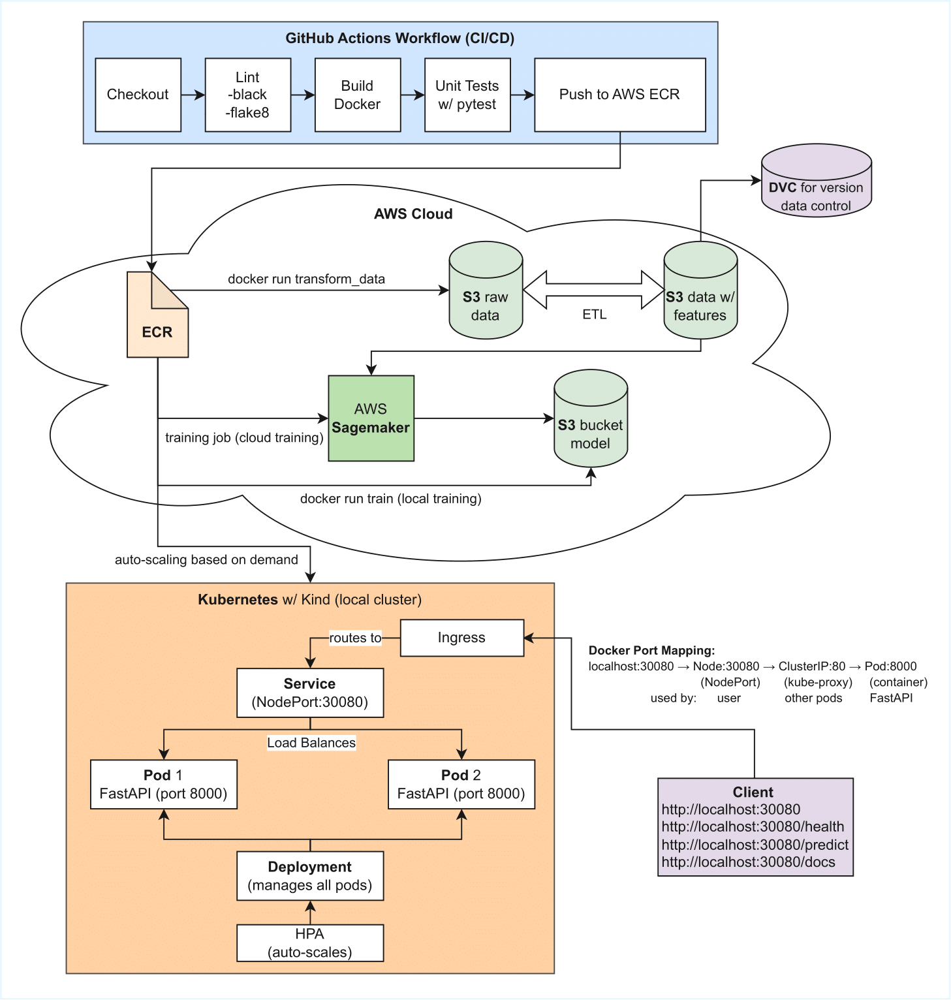

# MLOps Stock Forecasting

A **production-ready MLOps pipeline** for stock price prediction built with **XGBoost**. The project covers the full machine learning lifecycle, from data ingestion and feature engineering through model training, containerized deployment, and scalable inference serving.

The pipeline uses **AWS services** including S3 for data storage, ECR for container images, and SageMaker for model training. Docker ensures consistent environments, **DVC** handles data and model versioning, and **GitHub Actions** automates CI/CD workflows. A **FastAPI** inference service runs on **Kubernetes**, supporting horizontal auto-scaling for reliable, low-latency predictions.

## Architecture



*End-to-end MLOps pipeline with CI/CD automation via GitHub Actions, cloud training on AWS SageMaker, data versioning with DVC, and scalable model serving on Kubernetes with auto-scaling.*

---
## Tech Stack
- **ML Framework**: XGBoost for gradient boosting
- **API**: FastAPI for RESTful inference service
- **Data Versioning**: DVC for data and model tracking
- **Cloud Storage**: AWS S3 for scalable data storage
- **Containerization**: Docker for consistent deployments
- **CI/CD**: GitHub Actions for automated testing and building
- **Registry**: GitHub Container Registry (GHCR) for image distribution
- **Cloud Training**: AWS SageMaker for scalable model training
- **Container Registry**: AWS ECR for Docker image storage
- **Orchestration**: Kubernetes (Kind) for container orchestration
- **Auto-scaling**: Horizontal Pod Autoscaler (HPA) for dynamic scaling

## 1. Installation

```bash
# Clone the repository
git clone
cd MLops-Stock-Forecasting

# Create virtual environment
python -m venv venv
source venv/bin/activate

# Install dependencies
pip install -r requirements.txt

# Initialize DVC
dvc init
```

## 2. Run the Pipeline

### Option A: Using Makefile

#### Local Mode (Default)

```bash
# Run the entire pipeline (saves locally)
make all

# Or run individual steps
make download    # Download raw stock data (local)
make features    # Build features from raw data (local)
make train       # Train the model (local)
make predict     # Make predictions

# Run tests
make test

# Clean generated files
make clean
```

#### S3 Mode (Cloud Storage)

```bash
# Run with S3 upload/download
make download-s3    # Download data and upload to S3
make features-s3    # Build features and upload to S3
make train-s3       # Train model and upload to S3

# Or set environment variable for all commands
export USE_S3=true
make download
make features
make train
```

See [AWS S3 Setup](#aws-s3-setup) section for configuration.

### Option B: Using DVC Pipeline

```bash
# Run the entire pipeline
dvc repro

# Run specific stage
dvc repro download
dvc repro features
dvc repro train

# Check pipeline status
dvc status

# View pipeline graph
dvc dag
```

### Option C: Direct Python Execution

```bash
# Download data
python -m mlops_stock.data.download_data

# Build features
python -m mlops_stock.features.build_features

# Train model
python -m mlops_stock.models.train

# Make prediction
python -m mlops_stock.models.predict
```

### Unit Testing

Run the test suite:

```bash
# Run all tests
make test
# or
pytest tests/ -v

# Run specific test file
pytest tests/test_data.py -v
pytest tests/test_features.py -v
pytest tests/test_models.py -v
```

## 3. AWS S3 Setup

The pipeline supports storing data and models in AWS S3 for scalable, cloud-based storage.

### Prerequisites

1. **AWS Account** with S3 access
2. **AWS Credentials** configured:
   ```bash
   mkdir -p ~/.aws/credentials
   touch ~/.aws/config
   ```

3. **S3 Buckets** created:
   ```bash
   aws s3 mb s3://mlops-stock-raw --region us-east-1
   aws s3 mb s3://mlops-stock-features --region us-east-1
   aws s3 mb s3://mlops-stock-models --region us-east-1
   ```
4. **Add S3 as remote storage**
   ```bash
   pip install dvc[s3]
   #create a s3 bucket and IAM user
   dvc remote add -d myremote s3://mlops-stock-raw --region us-east-1
   dvc remote list
   dvc push
   ```
### Environment Variables

Set these to enable S3 mode:

```bash
export USE_S3=true
export S3_BUCKET_RAW=mlops-stock-raw
export S3_BUCKET_FEATURES=mlops-stock-features
export S3_BUCKET_MODELS=mlops-stock-models
export AWS_REGION=us-east-1
```
The pipeline automatically falls back to local files if S3 is unavailable.

## 4. Docker

```bash
# Build Image
docker build -t mlops-stock:latest .

# Download data
docker run --rm -v $(pwd)/data:/app/data mlops-stock:latest \
  python -m mlops_stock.data.download_data

# Build features
docker run --rm -v $(pwd)/data:/app/data mlops-stock:latest \
  python -m mlops_stock.features.build_features

# Train model
docker run --rm \
  -v $(pwd)/data:/app/data \
  -v $(pwd)/models:/app/models \
  mlops-stock:latest \
  python -m mlops_stock.models.train
```

## 5. FastAPI 

```bash
# Local
python -m mlops_stock.serve.app

# Or with Docker
docker run -p 8000:8000 \
  -v $(pwd)/data:/app/data \
  -v $(pwd)/models:/app/models \
  mlops-stock:latest \
  python -m mlops_stock.serve.app### API Endpoints
```

- `GET /` - API information
- `GET /health` - Health check (model loaded, files exist)
- `GET /predict` - Predict next day price using latest features
- `POST /predict/custom` - Predict with custom feature values

### Example Usage

```bash
# Health check
curl http://localhost:8000/health

# Get prediction
curl http://localhost:8000/predict

# Custom prediction
curl -X POST "http://localhost:8000/predict/custom" \
  -H "Content-Type: application/json" \
  -d '{"features": [150.0, 0.01, 149.5, 149.0, 148.5, 55.0, 60.0]}'
```

### Interactive API Documentation

Once running, visit:
- **Swagger UI**: http://localhost:8000/docs
- **ReDoc**: http://localhost:8000/redoc

## 6. Using GitHub Container Registry

The Docker image is automatically built and pushed to GHCR on every push to main.

```bash
#Login to GHRC
docker login ghcr.io -u <username> -p <token>

# Pull the image with Github Container Registry
docker pull ghcr.io/duarte3333/mlops-stock:latest

# Run tests
docker run --rm ghcr.io/duarte3333/mlops-stock:latest pytest tests/ -v

export IMAGE=ghcr.io/duarte3333/mlops-stock:latest

# Step 1: Download data
docker run --rm \
  -v $(pwd)/data:/app/data \
  $IMAGE \
  python -m mlops_stock.data.download_data

# Step 2: Build features
docker run --rm \
  -v $(pwd)/data:/app/data \
  $IMAGE \
  python -m mlops_stock.features.build_features

# Step 3: Train model
docker run --rm \
  -v $(pwd)/data:/app/data \
  -v $(pwd)/models:/app/models \
  $IMAGE \
  python -m mlops_stock.models.train

# Step 4: Run the API
echo "6. Running the API..."
docker run -d -p 8000:8000 \
  --name mlops-api \
  -v $(pwd)/data:/app/data \
  -v $(pwd)/models:/app/models \
  $IMAGE \
  python -m mlops_stock.serve.app

```
### Access the API

Once running, visit:
- API: http://localhost:8000
- Docs: http://localhost:8000/docs
- Health: http://localhost:8000/health

## 7. AWS SageMaker Training

Allows the model to train as a job on AWS SageMaker using Docker images from ECR.

```bash
# 1. Create ECR repo
export AWS_REGION=us-east-1
export AWS_ACCOUNT_ID=$(aws sts get-caller-identity --query Account --output text)
export ECR_REPO_NAME=mlops-stock-training

aws ecr create-repository --repository-name $ECR_REPO_NAME --region $AWS_REGION

# 2. Authenticate and push image
aws ecr get-login-password --region $AWS_REGION | \
    docker login --username AWS --password-stdin \
    $AWS_ACCOUNT_ID.dkr.ecr.$AWS_REGION.amazonaws.com

docker build -t mlops-stock:latest .
docker tag mlops-stock:latest \
    $AWS_ACCOUNT_ID.dkr.ecr.$AWS_REGION.amazonaws.com/$ECR_REPO_NAME:latest
docker push $AWS_ACCOUNT_ID.dkr.ecr.$AWS_REGION.amazonaws.com/$ECR_REPO_NAME:latest

# 3. Submit training job
bash scripts/sagemaker-training.sh

# 4. Monitor job
bash scripts/monitor-sagemaker.sh
```

### Setup SageMaker Role

Create IAM role in AWS Console:
- Trusted entity: AWS service → SageMaker
- Attach policies: `AmazonSageMakerFullAccess`, `AmazonS3FullAccess`, `AmazonEC2ContainerRegistryFullAccess`
- Role name: `SageMakerExecutionRole`

### Model Output

Models are saved to: `s3://mlops-stock-models/sagemaker-output/<job-name>/output/model.tar.gz`

## 8. Code Formatting

```bash
# Automatically reformats your Python code to a strict, consistent style
pip install black 
black mlops_stock/ tests/

# Check syntax errors, PEP 8 style violations, undefined variables, unused imports
pip install flake8
flake8 mlops_stock/ tests/ --max-line-length=100 --exclude=__pycache__
```

## 9. CI/CD

The project includes GitHub Actions workflows that:

- Run tests on every push/PR (inside Docker containers)
- Build Docker images
- Push images to GitHub Container Registry (GHCR)
- Check code formatting with black and flake8

View workflows in `.github/workflows/ci.yml`

## 10. DVC Workflow

This project uses DVC for data and model versioning with S3 remote storage.

### Setup DVC with S3

```bash
# Install DVC with S3 support
pip install 'dvc[s3]'

# Configure AWS credentials
aws configure

# Add S3 as DVC remote
dvc remote add -d myremote s3://mlops-stock-data/dvc-cache

# Push data to S3
dvc push

# Pull data from S3
dvc pull
```

### Basic DVC Commands

```bash
# Check what changed
dvc status

# Run the pipeline
dvc repro

# View pipeline stages
dvc stage list

# Show pipeline graph
dvc dag
```

## 11. Kubernetes Deployment

Deploy the FastAPI inference service on a local Kubernetes cluster using Kind (Kubernetes in Docker).

### Prerequisites

Install Kind (Kubernetes in Docker):

```bash
# Install Kind
curl -Lo ./kind https://kind.sigs.k8s.io/dl/v0.24.0/kind-linux-amd64
chmod +x ./kind
mv ./kind ~/.local/bin/kind

# Verify installation
kind --version
```

### Quick Start

Use the deployment script for easy management:

```bash
# Deploy everything (create cluster + build image + deploy)
./scripts/k8s-deploy.sh all

# Or run steps individually:
./scripts/k8s-deploy.sh create   # Create Kind cluster
./scripts/k8s-deploy.sh build    # Build and load Docker image
./scripts/k8s-deploy.sh deploy   # Deploy manifests
./scripts/k8s-deploy.sh metrics  # Install metrics-server for HPA
```

### Manual Deployment

```bash
# 1. Create the Kind cluster
kind create cluster --config kind-config.yaml

# 2. Build the inference Docker image
docker build -f Dockerfile.serve -t stock-predictor:latest .

# 3. Load image into Kind cluster
kind load docker-image stock-predictor:latest --name mlops-cluster

# 4. Deploy Kubernetes manifests
kubectl apply -f k8s/

# 5. Wait for deployment
kubectl rollout status deployment/stock-predictor-api -n mlops-stock

# 6. Install metrics-server (for HPA)
kubectl apply -f https://github.com/kubernetes-sigs/metrics-server/releases/latest/download/components.yaml
```

### Access the API

Once deployed, the API is available at:

```bash
# Root endpoint
curl http://localhost:30080/

# Health check
curl http://localhost:30080/health

# Get prediction
curl http://localhost:30080/predict

# Swagger docs
open http://localhost:30080/docs
```

### Kubernetes Commands

```bash
# Check cluster status
kubectl cluster-info

# View pods
kubectl get pods -n mlops-stock

# View services
kubectl get services -n mlops-stock

# Check HPA status
kubectl get hpa -n mlops-stock

# View pod logs
kubectl logs -n mlops-stock -l app=stock-predictor --tail=50

# Watch pods in real-time
kubectl get pods -n mlops-stock -w

# Get inside a pod
kubectl exec -it <pod-name> -n mlops-stock -- /bin/bash
```

### Manifest Files

| File | Description |
|------|-------------|
| `k8s/namespace.yaml` | Creates isolated `mlops-stock` namespace |
| `k8s/deployment.yaml` | Runs 2 FastAPI replicas with health checks |
| `k8s/service.yaml` | Exposes API on NodePort 30080 |
| `k8s/hpa.yaml` | Auto-scales pods (2-10) based on CPU/memory |
| `k8s/ingress.yaml` | Optional HTTP routing configuration |
| `kind-config.yaml` | Kind cluster configuration |

### Cleanup

```bash
# Delete deployment (keep cluster)
kubectl delete -f k8s/

# Delete entire cluster
kind delete cluster --name mlops-cluster

# Or use the script
./scripts/k8s-deploy.sh delete         # Delete resources
./scripts/k8s-deploy.sh delete-cluster # Delete cluster
```

1. curl http://localhost:30080/predict
         │
         ▼
2. Docker port mapping (kind-config.yaml)
   hostPort:30080 → containerPort:30080
         │
         ▼
3. Node receives on NodePort 30080
   kube-proxy intercepts
         │
         ▼
4. iptables DNAT rule
   Destination: ServiceClusterIP:80
   Rewrite to: PodIP:8000 (randomly selected)
         │
         ▼
5. Network packet routed to Pod
   (via CNI - kindnet in this case)
         │
         ▼
6. Pod receives on port 8000
   Uvicorn → FastAPI → XGBoost predict()
         │
         ▼
7. Response: {"prediction": 60.44}